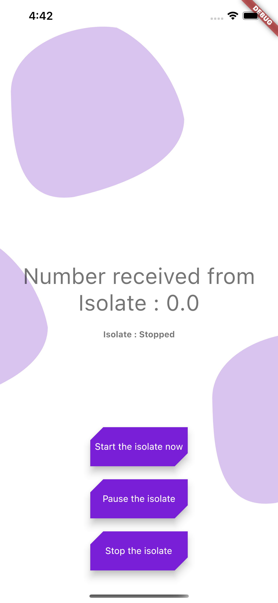

# Islate Explained

{ width=50% }

An explanation for Flutter Isolate functionality

## Isolate is a crucial feature in the dart language.

All Dart code runs in an isolate, and code can access classes and values only from the same isolate. Different isolates can communicate by sending values through ports (see ReceivePort, SendPort).

I implemeted a small flutter app to tech you how to implement Isolate usign Provider pattern.

Please check my blog for more info. 

